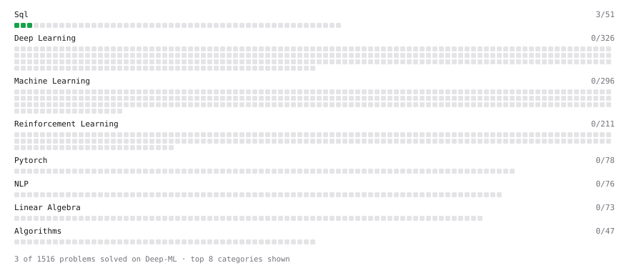

# Deep-ML

My machine learning practice from [Deep-ML](https://www.deep-ml.com). Every solution here was written by hand.

**16** solved · 16 problems · 0 labs · 0 math

[**Browse the interactive portfolio**](https://Abhi8756.github.io/deep-ml/) to replay this filling in over time.

## Problems

| | Difficulty | Solved | |
| --- | --- | --- | --- |
| [Average per group](https://www.deep-ml.com/problems/1108) | easy | 2026-10-02 | [solution](problems/1108-average-per-group) |
| [Count rows per group](https://www.deep-ml.com/problems/1107) | easy | 2026-10-02 | [solution](problems/1107-count-rows-per-group) |
| [Customers Who Never Placed an Order](https://www.deep-ml.com/problems/1460) | easy | 2026-10-08 | [solution](problems/1460-customers-who-never-placed-an-order) |
| [Delete Duplicate Emails Keeping One](https://www.deep-ml.com/problems/1112) | easy | 2026-10-03 | [solution](problems/1112-delete-duplicate-emails-keeping-one) |
| [Filter rows with WHERE](https://www.deep-ml.com/problems/1103) | easy | 2026-10-02 | [solution](problems/1103-filter-rows-with-where) |
| [Remove duplicates with DISTINCT](https://www.deep-ml.com/problems/1105) | easy | 2026-10-02 | [solution](problems/1105-remove-duplicates-with-distinct) |
| [SELECT all rows](https://www.deep-ml.com/problems/1101) | easy | 2026-10-02 | [solution](problems/1101-select-all-rows) |
| [Select specific columns](https://www.deep-ml.com/problems/1102) | easy | 2026-10-02 | [solution](problems/1102-select-specific-columns) |
| [Sort results with ORDER BY](https://www.deep-ml.com/problems/1104) | easy | 2026-10-02 | [solution](problems/1104-sort-results-with-order-by) |
| [Top N with LIMIT](https://www.deep-ml.com/problems/1106) | easy | 2026-10-02 | [solution](problems/1106-top-n-with-limit) |
| [Your first JOIN](https://www.deep-ml.com/problems/1109) | easy | 2026-10-02 | [solution](problems/1109-your-first-join) |
| [Each Customer's Lowest-Priced Order](https://www.deep-ml.com/problems/1122) | medium | 2026-10-08 | [solution](problems/1122-each-customer-s-lowest-priced-order) |
| [Employees Earning More Than Their Managers](https://www.deep-ml.com/problems/1113) | medium | 2026-10-03 | [solution](problems/1113-employees-earning-more-than-their-managers) |
| [Nth-Highest Salary with Ties and NULL](https://www.deep-ml.com/problems/1110) | medium | 2026-10-02 | [solution](problems/1110-nth-highest-salary-with-ties-and-null) |
| [Top-3 Salaries Per Department](https://www.deep-ml.com/problems/1111) | medium | 2026-10-03 | [solution](problems/1111-top-3-salaries-per-department) |
| [Top-N Most Profitable Companies with DENSE_RANK](https://www.deep-ml.com/problems/1123) | medium | 2026-10-08 | [solution](problems/1123-top-n-most-profitable-companies-with-dense-rank) |

---

_This file is regenerated by Deep-ML on every push._
